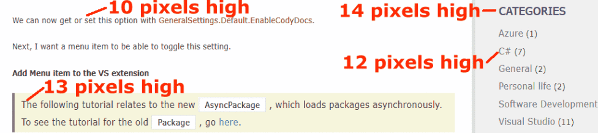
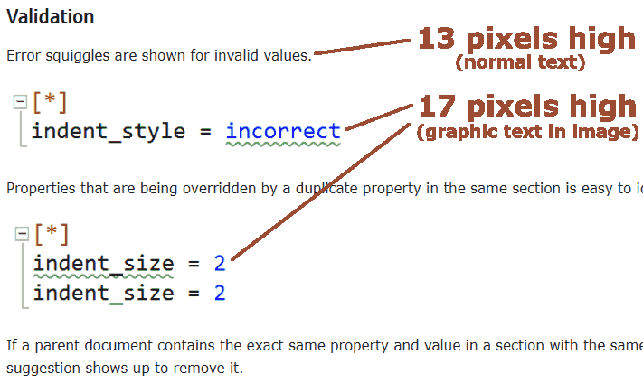

# Let’s adapt our website to the visitor (and not the contrary)

If you don’t have time: go to the [Quick reminders](#Quick-reminders)

Here I call **Adaptable Web Design** my interpretation of the concept of [Responsive web design](https://en.wikipedia.org/wiki/Responsive_web_design), except I choose a clearer title (some say I’m mad about [semantics](https://en.wikipedia.org/wiki/Semantics)).

The goal is to make our website readable by all users on all hardware.  
At least visually, since today I will not discuss adaptation to visually impaired users.

## Let’s take into account the visual acuity of the user

In a [previous article](https://chrisbertrandprogramer.wordpress.com/2018/08/03/let-your-website-readers-be-able-to-read-it/), I talked about the actual visual capacity of the user.

You can’t expect the user to have the same hardware as yours, that’s clear.  
Now you have to take into consideration other differences: the distance between the user’s eye and the screen, his visual acuity in general, the use of [ClearType](https://en.wikipedia.org/wiki/ClearType) or not, etc.

### How can we determine the user’s visual acuity ?

We can not directly. Because for some obscure reasons (which could include laziness and closed-mindedness), the operating systems do not include an [eye examination test](https://en.wikipedia.org/wiki/Eye_examination).

Fortunately, we have a good indicator: the user can choose his favorite font size in his Web browser’s settings.

We can use this setting indirectly thanks to the [`rem`](https://www.w3.org/Style/Examples/007/units.en.html#future) unit (available since 2013 and widely supported by the browsers):
```CSS
html, body {
  font-size: 1rem; /* Respects the user's setting */
}
h1 {
   font-size: 1.4rem; /* Relative to the root font size */
}
```
Note 1: We do not use the old unit `em` since it is relative to its upper elements/tags. In other words it’s relative, not static.

Note 2: The `rem` unit is in fact relative to the root element of the document. That is why in my example I defined a default size in the `html` element.

## Let’s use the user’s font size choice

The following [webpage](https://michaelscodingspot.com/2017/10/08/visual-studio-2017-extension-development-tutorial-part-2-add-menu-item/) does not respect the user’s font choice he made in his web browser settings. As a consequence, font sizes are inconsistent. The font size of the remark and the right menu should be both 10 pixels high, just as the normal text. In fact they should be both defined as `1rem`.

> 

## Use the `rem` length unit everywhere

Why not only on the text size ?  
Because the user’s visual acuity applies to all visual elements.

An example:  
I know people that have set their default font size to 32 pixels because they are visually impaired. They can read big texts only.  
As you can imagine, the same comes with the line thickness: they can’t distinguish narrow lines.  
That is why the line thickness should depend on the user’s visual acuity.

### And for the pictures ?

The following [webpage](https://github.com/madskristensen/EditorConfigLanguage) capture shows images that contain text (as pixels). This graphic text is greater than the normal text of the page.

> 

At first, pixels seem to be the logical size unit for pictures. But consider a picture that contains text, for example a screen capture. This text’s size has to be consistent with the actual text of the web page.

In the past we had to use the pixel unit for the pictures because the Web browsers did not resize the pictures correctly, creating ugly graphical effects.  
After a good dozen years, the browsers finally learned from their errors.

### What about printing ?

Two situations may be considered:

-   If the document is to be printed for this specific user, you should probably try to respect his preferences, at least the font size.  
    So you should use mainly the `rem` unit.
-   If the document is to be printed for many users (for example in the context of a company), you should adopt a general presentation.  
    So you could use the absolute units, such as `"cm", "mm" and "in"`.

That means your web page may offer two print options.

### Relative units

Sometimes, you need to adapt the size of an element to the size of an upper element (such as a column or the window itself).

-   Relative to the upper element: use percentage (`%`).
-   Relative to the top window/screen: `vh, vw, vmin, vmax`.

## Table of length units

In short, here is my advise.

| Unit | Screen | Print |
| :--- | :---- | :--- |
| % | yes | yes |
| ch | no | no |
| cm | no | when for all users |
| em | only when relative | only when relative |
| ex | improbable | improbable |
| in | no | when for all users |
| mm | no | when for all users |
| pc | no | when for all users |
| pt | no | when for all users |
| px | no | no |
| rem | yes | when for this user only |
| vh | yes | yes |
| vmax | yes | yes |
| vmin | yes | yes |
| vw | yes | yes |

For more information about units, please read [this page](https://www.w3schools.com/CSSref/css_units.asp).

## Don’t let overflow

A classical situation is when a website that has been designed for the desktop computers is displayed on a small screen, many elements overflow: the texts try to escape their column, the pictures are too large and too big, etc.

To constrain the texts to their container, you may word-wrap them all.  
\[ that is the [syllabification](https://en.wikipedia.org/wiki/Syllabification)/[hyphenation](https://en.wikipedia.org/wiki/Hyphen) \]  
A rule at the root is the most efficient:
```CSS
body {
  word-wrap:break-word;
}
```
Frankly, I don’t understand why it is not set by default in the HTML specification itself ! In my opinion, a text should never get out of its container, I see no good excuse to let it display on other elements (at least by default).

The source code `pre` paragraphs need something more:
```CSS
pre {
  white-space:pre-wrap;
}
```
Otherwise, the long words may disappear beyond a border and stay a mystery to your readers.

The pictures tend to overflow when reducing the window and when they are displayed on a small screen.  
I suggest to set a general rule to start with:
```CSS
img {
  max-width:100%;
}
```
As this has the side effect of distorting the pictures on window/parent-element resizing, you should let the browser take care of the pictures’ proportions.  
The easiest way is to give only one length to the pictures: whether the width or the height, but never both:
```HTML

```
I strongly advise you to use the same axis for all pictures and CSS rules.  
For example always the width (via `width, min-width` and `max-width`), and never set the height (via `height, min-height` and `max-height`).

## Adapt to the screen/window size

### Hide or reduce details on small screens.

Many websites go on showing empty space on left and right sides of the main document content.  
Others persist to display adverts or menus on one or even two sides of the main content.

You should reduce the size of the details, or even hide them totally.  
The special CSS rule `@media` serves this purpose:
```CSS
@media screen and (max-width: 40rem)
{
  .my-logo { /* picture */
    width:2rem;
    margin:0.4rem 0.5rem 0.25rem 0.5rem;
  }
}
```
### Show more details on large screens.

On the contrary, on big screens some websites display desperately empty areas.  
You may enjoy this free space displaying additional/optional elements, columns, menus, pictures.
```CSS
@media screen and (min-width: 90rem)
{
  .slide-left {
   ....
  }
}
```
### Inform the browsers

It can be useful to inform the browsers we take small screens into account.  
This way, they won’t try to interpret the website as a desktop one only. That makes the browsers display the website the way we made it, without distortions.  
Add to the HTML:
```HTML
<meta content="width=device-width" name="viewport" >
```
### Check narrow windows regularly

You can resize your browser’s window to a minimum (let’s say 15 characters wide) and check your website as this.  
Then you can maximize the window (in one click) and see how your website adapts to the new available space.

It is interesting to resize slowly the window with your mouse too. This way you may discover inconsistencies that appear only on specific sizes.

### Check real small hardware regularly

What better than a test in real conditions ?  
Of course you need a private test server and a set of hardware (phones, tablets, television, etc).

## Other adaptations

### High-contrast themes and forced colors

The user can set a high-contrast theme at the operating system level. This kind of theme has been designed for visually impaired people. Such themes can display black on white, white on black, or any colors. The web browser, as should any application, adapts its colors according to the theme and usually overrides the website colors.  
That is something you can not control. Once again your website must adapt itself to the environment.

Apart from the OS themes, many web browsers let the user impose his own colors. In that case too, your website will display colors it was not designed for.

Considering the multiple possibilities that are out of your control, you may follow one rule at least:  
Always set _both_ the background and the foreground colors, never one of them only. They should be synchronized/consistent at any moment, because you can’t always assume inherited colors (from parent elements).
```CSS
pre {
  background-color: #e0e090;
   color:black;
}
```
I strongly advise you to check your website using a high-contrast theme and a browser custom colors profile from time to time in order to ensure it remains readable in all conditions.

<a name="Quick-reminders"></a>
## Quick reminders

1.  **Use the** **[rem](https://www.w3.org/Style/Examples/007/units.en.html#future) length unit for almost everything:**  
    texts, images, borders, margins..  
    Never, never use pixels (`px`), `ch, ex`.  
    Use `em` for relative sizes.  
    Other possible units: percentages (`%`), `vh, vw, vmin, vmax`.  
    For printing all-users documents only: `cm, mm, in, pt, pc`.
    ```CSS
    html, body {
      font-size: 1rem; /* Respects the user's setting */
      letter-spacing: 0.04rem; /* relative to the font size */
      line-height: 1.3rem; /* relative to the font size */ 
    }
    h1 {
       font-size: 1.4rem; /* Relative to the root font size */
    }
    pre { /* source codes */
      border: 0.12rem solid #a08000;
    }
    #logo { /* pictures */
      height: 4rem; /* synchronizes the size with the text */
    }
    .slide-left{ /* use rem in the calculations too: */
      width: calc(((100**%** - 60rem) / 2) - 2rem);
    }
    ```
2.  **Always wrap words:**
```CSS    
    body {
      word-wrap:break-word;
    }
```
3.  **Cut long words too in source codes:**
```CSS    
    pre {
      white-space:pre-wrap;
    }
```    
4.  **Limit the pictures’ size on resizing the window:**
```CSS    
    img {
      max-width:100%;
    }
```    
5.  **_Never_ set both the width and the height of a picture:**  
    Let the browser manage the picture proportions on resizing.
```HTML    
    
```    
6.  **Inform the browsers we take small screens into account:**
```HTML    
    <meta content="width=device-width" name="viewport" />
```    
7.  **Reduce some elements on small screens:**  
    You can even hide them.
```CSS    
    @media screen and (max-width: 40rem)
    {
      .my-logo { /* picture */
        width:2rem;
        margin:0.4rem 0.5rem 0.25rem 0.5rem;
      }
    }
```    
8.  **Allow more space to the elements on large screens:**  
    Or even let entire columns appear only on large windows.
```CSS    
    @media screen and (min-width: 90rem)
    {
      .slide-left {
       ....
      }
    }
```    
9.  **Always set both front color _and_ background color:**  
    If you set one of them only, your text may be unreadable on some configurations.
```CSS    
    pre {
      background-color: #e0e090;
      color:black;
    }
```    
10.  **Select default fonts:**  
    With the variety of hardware, operating systems and languages, you can’t count on your favorite font to be present.
```CSS    
    font-family:  "Open Sans","Helvetica Neue", Verdana, Helvetica,Arial,sans-serif;
```    

\[ As usual, if you think my English writing is just horrible, you are free to correct my text and send me your fixed HTML document \]

Special: please note this present page may not respect all my principles since the style is limited by the server. I chose the most respectful style theme available, but it has its limitations.