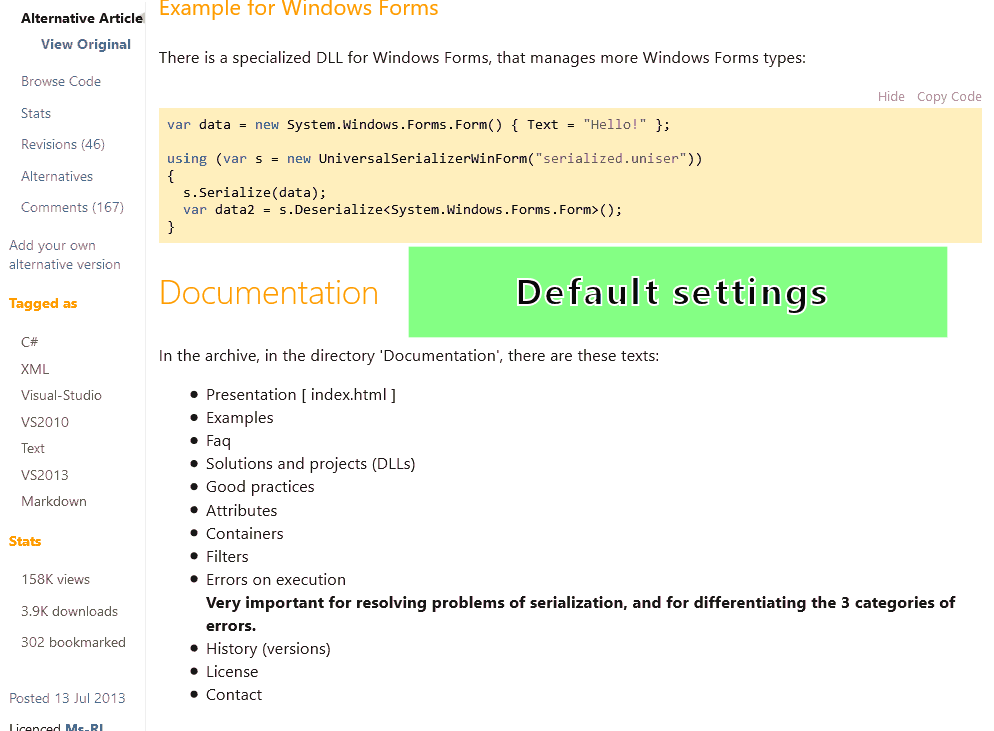
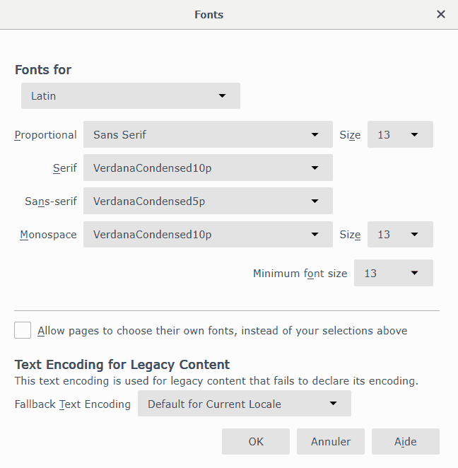

Make all websites look alike on FireFox (2019-02-11)
====================================================

I finally decided to stop zooming in and out when browsing websites.

The only way was to *force* my web browser, FireFox, to display *my* favorite
fonts, not the favorite fonts of every web designer. And my favorite font size
as well.

Fortunately, FireFox offers that possibility, but that needs a bit of work.  
That’s definitively worth the time, especially if you browse the Web all day
long as I do.

 

As you see in this screen shot of
[CodeProject](https://www.codeproject.com/Articles/620154/UniversalSerializer),
the default settings display the page with many different font sizes while the
proposed custom settings display it with consistent font sizes.  
Of course, you can tweak these settings at will.

 

The procedure
-------------

 

### First step: setup default fonts in FireFox

 

1.  Open FireFox’s settings.

2.  Section "*General*".

    1.  Sub-section "*Fonts and Colors*".

        1.  Button "*Advanced...*".

            1.  "*Latin*"

                1.  "*Proportionnal*" = "*Sans serif*" Size 13.

                2.  "*Serif*" = "*Verdana*" **→ set your favourite font for
                    source codes.**

                3.  "*Sans-serif*" = "*Verdana*" **→ set your favourite font for
                    normal text.**

                4.  "*Monospace*" = "*Verdana*" Size 13 **→ set your favourite
                    font for source codes.**

                5.  "*Minimum font size*" = 13.

            2.  "*Other writing systems*"

                6.  Same settings as in "Latin".

            3.  Uncheck "*Allow pages to choose their own fonts, instead of your
                selections above*".

            4.  Button "*OK*" to save these settings.

3.  Close the settings panel/page.

 

The settings panel should look like that:

In this screen capture, I use two different fonts only:

-   *VerdanaCondensed***5***p* for ordinary text.

-   *VerdanaCondensed***10***p* for source code.

[ By the way, these fonts are condensed versions I created using the technique
described in my previous article [How to condense a
font](https://github.com/ChrisBertrandDotNet/Blog/blob/master/General/How%20to%20condense%20a%20font%20(2019-01-28).md).]

 

### Second step:

 

1.  In FireFox, enter this address:  
    `about:support`

2.  *Profile Folder* or *Profile Directory* (depending on OS and application
    version) contains a button labeled "*Show Folder*" (Windows) "*Open
    Directory*" (Linux) "*Open Containing Folder*" (Windows and Linux) or "*Show
    in Finder*" (Mac OS) that provides quick access to your profile folder.  
    Click on it.

3.  In the file manager, copy the directory address of your profile.

4.  In FireFox, download my configuration file:
    [userContent.css](https://raw.githubusercontent.com/ChrisBertrandDotNet/Blog/master/Web/userContent.css).  
    Save it to your profile directory.

5.  Close FireFox (all its windows) and restart it.

 

Now FireFox should display your favorite fonts in all websites.

Let’s check that:

1.  Display a source code on GitHub:  
    <https://github.com/ChrisBertrandDotNet/OpenMAFF/blob/master/Sources/OpenMAFF/Common.cs>

2.  Right-click somewhere in the source code, then click on the menu “*Inspect
    element*”.

3.  In the calculated styles, check the font family.

    -   Before modifying our settings, the font was “*SFMono-Regular, Consolas,
        Liberation Mono, Menlo, etc*”.

    -   Now it is “*serif*”, which actually displays the font you set in the
        FireFox’s settings.

 

Now enjoy browsing a wonderful Web where you don’t need to zoom all the time or
buy new glasses ! ;)

 

When you change the font settings in FireFox, all open pages will be adapted
automatically and immediately.  
So you can experiment different fonts and font sizes and evaluate the result.
You don’t need to restart FireFox.

For example, set the default serif font as “*Segoe Script*” (on Windows) in the
“*Latin*” section, and admire source codes displayed as if they were
hand-written.

 

How does it work ?
------------------

When FireFox starts (opens its first window, in fact), it looks in the profile
directory for a file named *userContent.css*, then loads it if there is one
available.  
When opening a webpage, FireFox applies the styles from our CSS, *then* load and
apply the styles listed by the page.

In our file, most styles are forced, using the `!important` keyword, usually
overriding the page’s styles.  
Example:

~~~~~~~~~~~~~~~~~~~~~~~~~~~~~~~~~~~~~~~~~~~~~~~~~~~~~~~~~~~~~~~~~~~~~~~~~~~~~~~~
font-family: sans-serif !important;
~~~~~~~~~~~~~~~~~~~~~~~~~~~~~~~~~~~~~~~~~~~~~~~~~~~~~~~~~~~~~~~~~~~~~~~~~~~~~~~~

 

The proposed CSS file has some features:

-   Ordinary text is always displayed using the default `sans-serif` font.  
    Firefox uses your settings, that is the fonts you set up on the first step.

-   Source code, in fact everything in `pre` and `code` tags, is always
    displayed as `serif`.  
    This font comes from the settings in FireFox too.  
    By the way, it is not necessarily a true *serif* font. We only use this
    classification in order to separate regular texts from source code texts.

-   Font sizes are constant.  
    All text is 1rem high, so FireFox applies the font size you set up during
    the first step.  
    Headings height is constant too, for example `h1` is `1.3rem`.

-   I added a fix for GitHub, which does not use `code` tags in source codes, by
    setting the class `blob-wrapper`.

-   I force word splitting (*hyphenation*) of long words in source codes.  
    That is important in some languages where elements are not always separated
    by spaces.

-   All text has a constant line height.  
    Otherwise, many websites would look like sparse lines.  
    I noted that causes trouble in rare occasions. When possible, I added
    specific styles to fix the problem.

-   A problem can occur in some websites where “icons” are displayed as font
    characters.  
    Depending on the character code, it may not be displayed correctly (you will
    see the code in place of the character/icon). I noted other websites use
    codes that work fine, so it’s technically possible.  
    The problem comes from the fact we force our fonts. So these fonts display
    all codes they manage. Custom fonts are displayed only for other codes.

 

Do not hesitate to play with the CSS file and report problem (or better, propose
solutions) [here](https://github.com/ChrisBertrandDotNet/Blog/issues).

Anyway, if you are not happy with the result, just rename or delete the file,
then restart FireFox.
